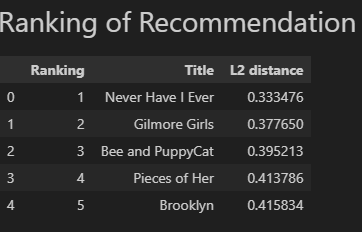

# Topic: Netflix popular movies recommendation
- Dataset from kaggle https://www.kaggle.com/datasets/narayan63/netflix-popular-movies-dataset
- only 200 row for easy use

## Usage
### System File
- Load data, embedd data, and search result in `recommend_sys.ipynb` 

### Environment
- python3.9
- Create conda environment using commend `conda create -n recommend_sys python=3.9`
- Install all python package using commend `pip install -r requirements.txt`

### Implement whole system 
- run the whole `recommend_sys.ipynb` file to see the results at the bottom of Query and show ranking section

## Sentence Embedding model
- gte-small model download from huggingface repository `thenlper/gte-small`
- Auto download model at Sentence embedding section
- gte-small model with vector size 348 for a sentence
- Faster searching time then using BERT or other larger embedding model

## Similarity search 
- FAISS implementation
- Use IndexIVFFlat (Inverted File Index) method rather then just using L2 distance for faster searching
- Set the number of cells to the square root of the size of dataset as the optimal solution

## Example Results
### Query1: I want a movie that girl is the main charater

### Query2: I like romance movies

### Query3: I like animates

### Query4: South Park
